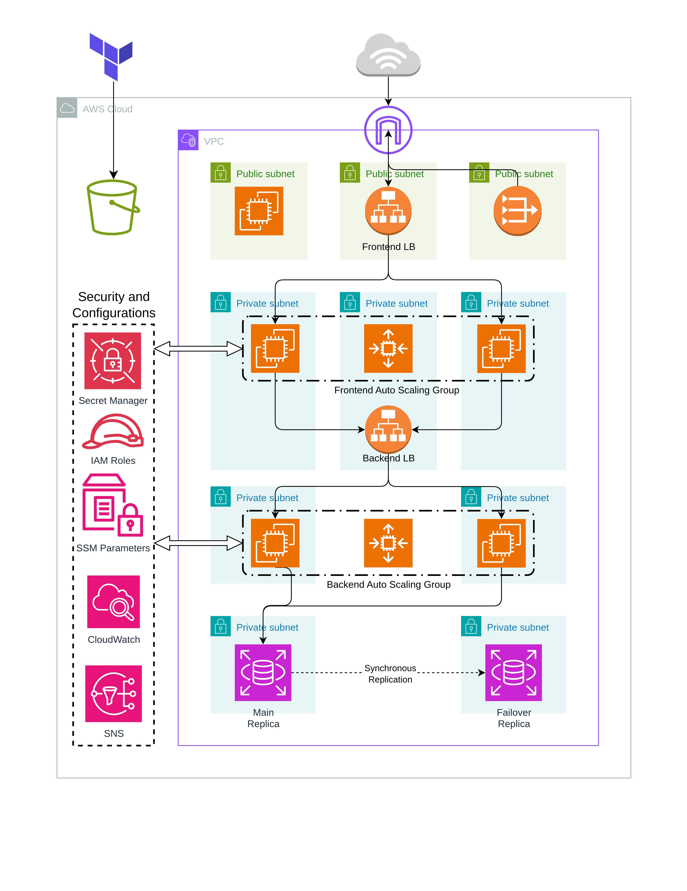
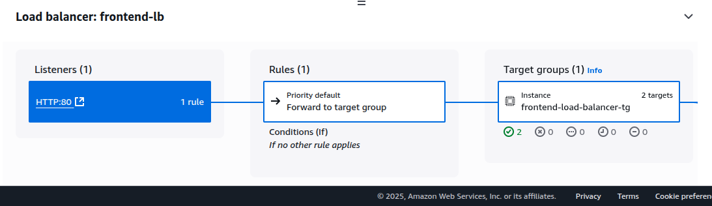

# 3-Tier Application Infrastructure on AWS using Terraform

[](https://aws.amazon.com)
[](https://www.terraform.io/)

## Overview

This repository provisions a highly available, secure, and scalable 3-tier web application infrastructure on AWS using Terraform. The architecture separates the application into frontend, backend, and database layers, each deployed in isolated subnets with strict security controls.

## Architecture

- **VPC**: Custom VPC with public and private subnets across multiple Availability Zones.
- **Public Subnets**: Host the bastion server and frontend load balancer.
- **Private Subnets**: Host application servers (frontend and backend), backend load balancer, and RDS database.
- **NAT Gateway**: Allows outbound internet access for private subnets.
- **Security Groups**: Restrict traffic between tiers and from the internet.
- **RDS (MySQL)**: Multi-AZ deployment for high availability.
- **IAM Roles**: Grant EC2 instances least-privilege access to secrets and parameters.
- **S3 Backend**: Stores Terraform state securely for team collaboration.

## Features

- Multi-AZ deployment for all tiers
- Automated bootstrapping of EC2 instances
- Secure storage of secrets and configuration
- Modular, reusable Terraform code

## Directory Structure

- `Modules/Network`: VPC, subnets, route tables, NAT gateway, security groups
- `Modules/Compute`: Launch templates, Auto Scaling Groups, EC2 profiles
- `Modules/Storage`: RDS MySQL with subnet group and security
- `Modules/Security`: Secrets Manager and SSM Parameter Store integration

## Usage

### Prerequisites

- [Terraform](https://www.terraform.io/downloads.html) >= 1.0
- AWS CLI configured with appropriate credentials

### Steps

1. **Create an S3 bucket**  
   Create an S3 bucket in your AWS account to store the Terraform state file.

2. **Edit `backend.tf`**  
   Update the `backend.tf` file with your S3 bucket name and region.

3. **Edit email in `terraform.tfvars`**  
   Set your notification email address in the `cloudwatch-alarm-email` variable in `terraform.tfvars`.

4. **Edit `secrets.tfvars` with the proper credentials**  
   Provide your database username and password in `secrets.tfvars`.

5. **Initialize Terraform**
   ```sh
   terraform init
   ```

6. **Plan the deployment**
   ```sh
   terraform plan
   ```

7. **Apply the configuration**
   ```sh
   terraform apply
   ```

8. **Access the application using the Load Balancer DNS**  
   After deployment, use the outputted Load Balancer DNS to access your application.

## Inputs

See `terraform.tfvars` for configurable variables such as:
- VPC and subnet CIDRs
- Subnet-to-tier mapping
- Database credentials and names
- Ports for backend and database

## Outputs

- VPC ID
- Subnet IDs
- Security Group IDs
- RDS endpoint

## Security

- All secrets (DB credentials) are stored in AWS Secrets Manager or SSM Parameter Store.
- EC2 instances use IAM roles with least-privilege access.
- No public access to backend or database tiers.

## Diagrams

Below are diagrams illustrating the infrastructure and network flow:


*High-level architecture overview*



*Load Balancers Health Checks*

---