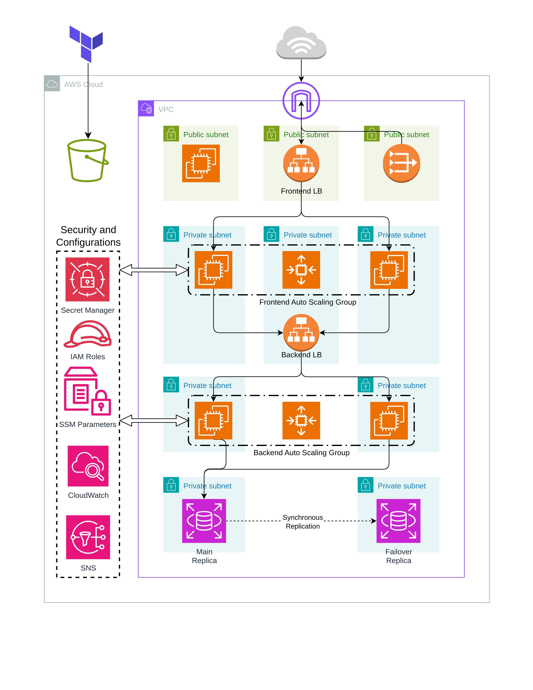
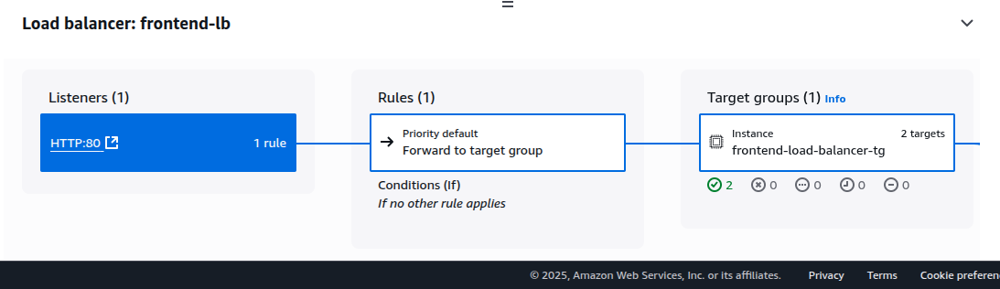
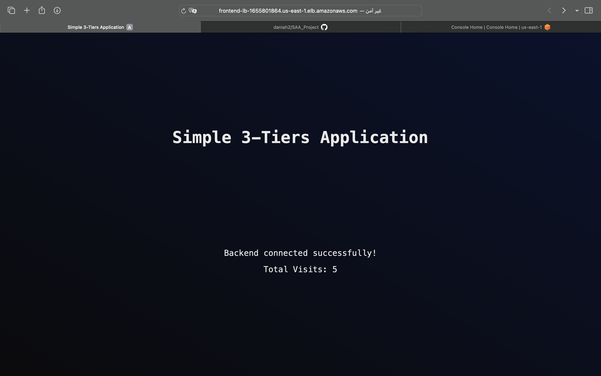

# 3-Tier Application Infrastructure on AWS using Terraform

This project provisions a highly available, secure, and scalable 3-tier web application infrastructure on AWS using Terraform. The architecture is organized into three layers: **frontend**, **backend**, and **database**, each deployed in isolated subnets with strict security boundaries.

## Architecture Overview

- **Custom VPC** with public and private subnets across multiple Availability Zones (AZs).
- **Public Subnets** host the bastion server and the frontend load balancer.
- **Private Subnets** host the frontend/backend application servers, backend load balancer, and RDS database.
- **NAT Gateway** allows outbound internet access for resources in private subnets.
- **Security Groups** restrict traffic flow between tiers and from the internet.
- **RDS (MySQL)** deployed in Multi-AZ mode for high availability.
- **IAM Roles** provide EC2 instances with least-privilege access to secrets and parameters.
- **S3 Backend** securely stores the Terraform state to support team collaboration.

## Key Features

- Multi-AZ deployment across all application layers
- Automated EC2 instance bootstrapping
- Secure and centralized management of sensitive data (e.g., DB credentials)
- Modular and reusable Terraform codebase

## Directory Structure

- `Modules/Network`: Defines VPC, subnets, route tables, NAT gateways, and security groups
- `Modules/Compute`: Includes launch templates, Auto Scaling Groups (ASG), and EC2 profiles
- `Modules/Storage`: Provisions MySQL RDS instance with subnet group and security configuration
- `Modules/Security`: Integrates AWS Secrets Manager and SSM Parameter Store for secure configuration management

## Security Highlights

- All sensitive credentials (such as database passwords) are stored in AWS Secrets Manager or Systems Manager Parameter Store.
- IAM roles enforce least-privilege access for compute resources.
- Backend and database tiers are not exposed to public internet access.

## Diagrams

### Solution Architecture

### Load Balancer Health Checks

---

## Deliverables

### ✅ 1. Solution Architecture Diagram
A visual representation of the infrastructure and network flow is included above in the **Diagrams** section.

### ✅ 2. GitHub Repository
This repository contains all Terraform code and documentation necessary to provision and deploy the application infrastructure on AWS.

### ⚡ 3. Demo Video 

- [Recorded Deployment Video](Docs/Demo.mov)

> **📸 Screenshots of Deployed Web Application**

- 

---

